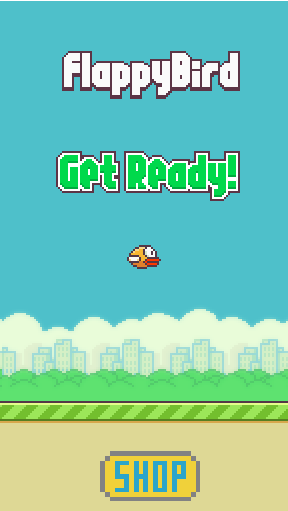
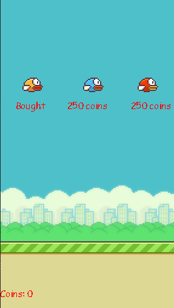
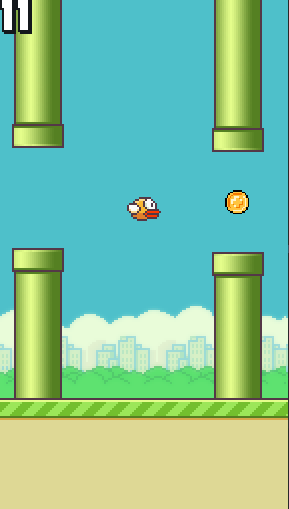
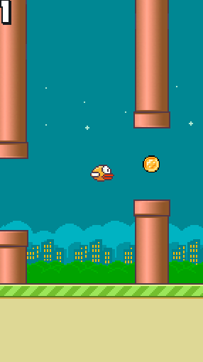
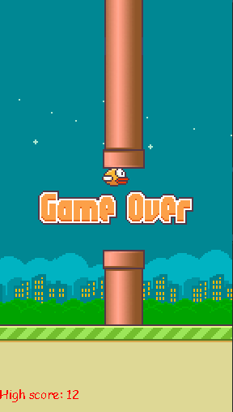

# Flappy Bird
Проект по Pygame Коновалова Александра и Эрика Варданяна
* Данная работа предназначена для создания собственной игры.

## ТРЕБОВАНИЯ К ПРОГРАММНЫМ И АППАРАТНЫМ СРЕДСТВАМ
Приложение предназначено для работы на персональных компьютерах с уставленным на них интерпретатором Python версии 3.8 (рекомендованно) с установленными библиотеками (requirements.txt), если запуск происходит с помощью файла main.py.

## УСТАНОВКА ПРИЛОЖЕНИЯ
### Загрузка
``` 
git clone https://github.com/Ytenochek/Flappy_Bird.git
cd Flappy_Bird
pip3 install -r requirements.txt
```
### Запуск
#### С помощью исходного кода
##### Windows
``` 
py main.py
```
##### Linux
``` 
python3 main.py
```
#### С помощью бинарного файла
##### Windows
``` 
cd release/win
"Flappy Bird.exe"
```
##### Linux
``` 
cd release/lin
"Flappy Bird"
```
## Игра
### Интерфейс
#### Главное меню

##### Элементы
* Надписи названия игры
* Главный герой
* Кнопка перехода в магазин
##### Управление
* `Space` - начать игру
* `ЛКМ` по кнопке `SHOP` - перейти в магазин

#### Магазин

##### Элементы
* Скины
* Стоимость скинов
* Количество монет
##### Управление
* `ЛКМ` по кнопке `СКИНУ` - приобрести, поменять скин и вернуться в главное меню

#### Игра

##### Элементы
* Счёт
* Главный герой
* Трубы
* Монеты (шанс появления 1 к 3)
* Земля
При прикосновении главного героя к трубам или земле игра заканчивается. 
##### Управление
* `Space` - сделать прыжок
#####
Существует вероятность того, что задний план и скины труб изменятся (1 к 2).


#### Конец игры

##### Элементы
* Текст: `Game over`
* Рекорд
#####
По завершению открывается главное меню.

### Геймплей
Цель игры состоит в управлении полётом птицы, которая непрерывно передвигается между рядами труб. При столкновении с ними происходит завершение игры. Управление производится кнопкой `Space`, после птица совершает небольшой рывок вверх. При отсутствии рывков птица падает из-за силы тяжести, и игра также завершается. Очки набираются при каждом успешном перелёте между двумя трубами.
